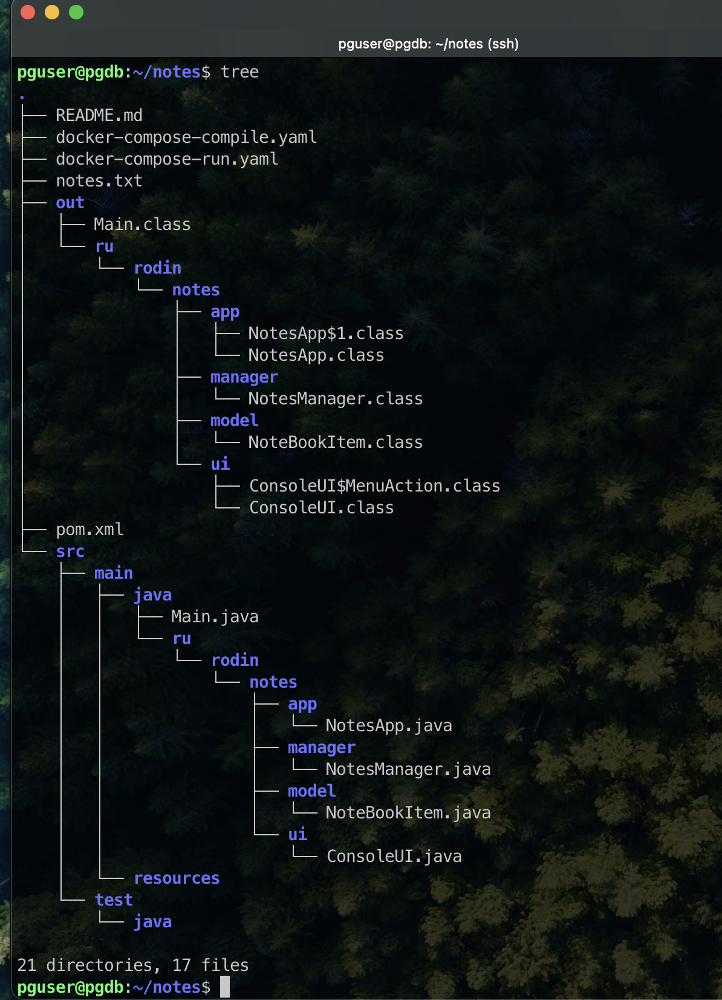

# Java Core (семинары)

## Урок 1. Компиляция и интерпретация кода

Структура приложения:



Команда для компиляции

```bash
  javac -sourcepath ./src/main/java/ -d out ./src/main/java/Main.java
```

Команда для запуска

```bash
  java -classpath ./out Main 
```